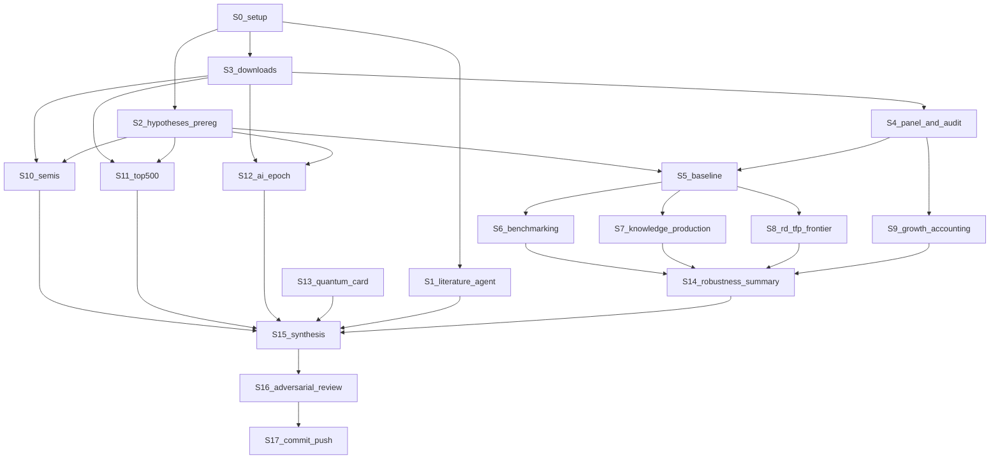

# DEEP_RESEARCH_PLAN — пошаговый план углублённого исследования

**Статус:** исторический план. Актуальная спецификация — `DEEP_RQ_AND_HYPOTHESES.md` и `DEEP_RESULTS.md`. Не использовать как инструкцию к объёму R&D, тесту Хаусмана, `ctfp` в роли зависимой или LPM.

Ветка: `deep-research` (от `report-20pp`). Старые файлы не удаляются, новые кладутся в отдельные папки `deep/`.
Результат этого плана — **исполненные Jupyter-ноутбуки** с таблицами и графиками. Текст отчёта и презентация — отдельный следующий этап (в конце плана).

Первое действие после подтверждения: скопировать этот план в корень репозитория как `DEEP_RESEARCH_PLAN.md` и закоммитить.

---

## 0. Что изменилось по сравнению с текущим проектом (одним абзацем)

Сейчас проект описывает 8 стран и почти не связывает технологии с экономикой. В новой версии:
- 39 стран (38 стран OECD + Китай) вместо 8, поэтому регрессии получают около 39 кластеров вместо 7;
- правильная мера производительности (`rtfpna` вместо `ctfp`), а `ctfp` используется по назначению — как отставание от лидера;
- три оцениваемых звена цепочки (R&D → патенты, R&D → производительность, источники роста);
- три технологических блока с реальными рядами: торговля микросхемами и оборудованием для их производства (с «зеркальной» оценкой Тайваня), TOP500 за 2010–2025, модели ИИ по странам и типу доступа (открытые или закрытые) из Epoch AI.

Проверено до написания плана: все источники доступны бесплатно. Для импорта Китаем микросхем в 2023 году пробный запрос вернул $350 млрд при экспорте $136 млрд. Импорт Китаем из «Other Asia, nes» (так Comtrade обозначает Тайвань) — $135 млрд.

---

## 1. Исследовательский вопрос и гипотезы (решение принято)

**Главный вопрос.** Согласуются ли данные 2000–2023 годов с образом двух разных путей технологического развития — американского (работа у технологического фронтира, интенсивность исследований, контроль над передовыми звеньями и закрытость передовых моделей) и китайского (масштаб, догоняющее освоение технологий, производственная база, открытость моделей) — и в каких звеньях цепочки «наука → инновации → производство → вычисления → экономический эффект» эти различия проявляются, а в каких нет?

Формулировка следует из задания: там пары «закрытая крепость против открытой экосистемы» для ИИ, «литография против производственной базы» для чипов и «гонка за эксафлопсами, GPU против собственных ускорителей» для суперкомпьютеров.

**Подвопросы и гипотезы** (окончательно фиксируются на этапе 2, до расчётов):
- **ПВ1, сравнение с нормой.** Где США и Китай отклоняются от нормы для своего уровня дохода и размера? Гипотеза H1: у Китая «масштабные» показатели (патенты, статьи, доля промышленности, hi-tech экспорт) выше нормы сильнее, чем интенсивность R&D; у США выше нормы прежде всего интенсивность R&D.
- **ПВ2, R&D → инновации.** Как R&D связан с патентами? Гипотеза H2: эластичность больше нуля; у Китая патентов на единицу R&D больше. Конкурирующее объяснение — субсидии на подачу заявок.
- **ПВ3, R&D → производительность.** Зависит ли связь R&D и роста TFP от отставания от лидера? Гипотеза H3: взаимодействие R&D × отставание положительно — это «путь догоняющего освоения».
- **ПВ4, экономический эффект.** За счёт чего росли экономики? Гипотеза H4: у Китая доля капитала в росте больше, а доля TFP меньше, чем у США.
- **ПВ5, полупроводники.** Гипотеза H5: Китай — чистый импортёр микросхем на протяжении всего периода, существенная часть импорта идёт из Тайваня и Кореи; оборудование для производства чипов экспортируют в основном Нидерланды, Япония и США.
- **ПВ6, вычисления.** Гипотеза H6: доля Китая в TOP500 выросла, а затем упала после 2019 года прежде всего из‑за прекращения подачи новых систем; доля Китая в суммарной мощности ниже его доли по числу систем; верхушку американских систем составляют машины с GPU (NVIDIA/AMD), а китайских — машины на собственных процессорах.
- **ПВ7, ИИ.** Гипотеза H7: при прочих равных (год, тип организации, область) китайские заметные модели чаще открыты, чем американские; у США больше моделей фронтира и выше максимальный объём вычислений на обучение.
- **Квант** — только качественная карточка на существующем снимке. Эконометрики нет: технология незрелая, рядов нет.

**Что не измеряется и остаётся качественным:** RISC-V, роботизация и компьютерное зрение на производстве, военное использование суперкомпьютеров. Для последнего есть только частичный индикатор — доля систем в TOP500 с сегментом Government. Это прямо пишется в выводах.

---

## 2. Структура файлов (создаётся на этапе 0)

- `scripts/deep/` — скрипты загрузки: по одному на источник.
- `data/raw/deep/<source>/` — сырые файлы + `manifest.json` (URL, дата, число строк, sha256).
- `data/deep/panel_oecd_chn.csv` — итоговая панель страна × год.
- `data/deep/data_dictionary_deep.csv` — словарь переменных.
- `notebooks/deep/_common.py` — общие функции: пути, загрузка панели, FE-регрессия, стиль графиков.
- `notebooks/deep/*.py` — ноутбуки в формате jupytext (percent), рядом парные `.ipynb`.
- `results/deep/tables/`, `results/deep/figures/` — результаты.
- Документы в корне: `DEEP_RESEARCH_PLAN.md`, `DEEP_RQ_AND_HYPOTHESES.md`, `DEEP_DEVIATIONS.md`, `DEEP_LITERATURE_NOTES.md`, `DEEP_RESULTS.md`, `DEEP_REVIEW.md`.

---

## 3. Порядок этапов и зависимости

**Параллельно можно делать:** S1 одновременно со всем остальным (фоновый агент); загрузки S3a–S3f — независимо друг от друга; S6, S7, S8, S9 после S4/S5 — независимо; S10, S11, S12 — независимо.

**Жёсткие правила:**
- ни один ноутбук с оценками (S6–S12) не запускается, пока не закоммичен `DEEP_RQ_AND_HYPOTHESES.md` с твоими ожиданиями;
- любое отклонение от зафиксированного плана записывается в `DEEP_DEVIATIONS.md`: дата, что изменили, почему.

**Бюджет времени:**
- выходные 1 — этапы S0–S5, плюс S1 в фоне;
- выходные 2 — S6–S9;
- выходные 3 — S10–S17.

---

## S0. Подготовка окружения (≈1 час)

- **Цель.** Рабочая среда и пустой каркас.
- **Шаги.**
  1. Убедиться, что текущая ветка — `deep-research` (`git rev-parse --abbrev-ref HEAD`) и рабочее дерево чистое.
  2. Установить недостающие пакеты: `pip install linearmodels xlrd jupytext ipykernel`. Сейчас их нет, остальное (pandas, statsmodels 0.15, sklearn, matplotlib, openpyxl) уже установлено.
  3. Создать `requirements-deep.txt` с версиями: `pip freeze | findstr /i "pandas numpy statsmodels linearmodels xlrd openpyxl matplotlib jupytext requests scipy"`.
  4. Создать папки из раздела 2.
  5. Написать `notebooks/deep/_common.py`:
     - константа `COUNTRIES` — 39 кодов ISO3: AUS AUT BEL CAN CHL COL CRI CZE DNK EST FIN FRA DEU GRC HUN ISL IRL ISR ITA JPN KOR LVA LTU LUX MEX NLD NZL NOR POL PRT SVK SVN ESP SWE CHE TUR GBR USA CHN;
     - функция `load_panel()`;
     - функция `twfe(df, y, xs, fe=("country","year"), cluster="country")` на `statsmodels.formula.api.ols` с дамми `C(country)`, `C(year)` и `cov_type="cluster"`. Она возвращает таблицу β, SE, p, CI, N и G. Это та же OLS с дамми, её легко объяснить;
     - функция `save_table(df, name)` → `results/deep/tables/name.csv`; функция `save_fig(fig, name)` → `results/deep/figures/name.png` (dpi 150);
     - единый стиль графиков: США синим, Китай красным, остальные серым.
  6. Скопировать план в `DEEP_RESEARCH_PLAN.md`. Добавить в начало `PROJECT_STATE.md` двухстрочный баннер: «на ветке deep-research действуют документы DEEP_*».
- **Проверка перед переходом.** `python -c "import linearmodels, xlrd, jupytext"` проходит; `from notebooks.deep._common import twfe` работает на игрушечных данных. Коммит `S0: deep-research scaffold`.

---

## S1. Литература и первоисточники (фоновый агент, параллельно)

- **Цель.** Проверенные ссылки для каждого метода и для каждой оговорки о данных — без выдуманных цитат.
- **Что проверяет агент (только первоисточники):**
  - Solow (1957) — разложение роста.
  - Griliches (1979, 1990) — функция производства знаний, патенты как индикатор.
  - Coe & Helpman (1995) — R&D и TFP на панели стран.
  - Griffith, Redding & Van Reenen (2004) — «две стороны R&D», взаимодействие с отставанием от фронтира.
  - Aghion & Howitt — рост через фронтир и догоняющее освоение.
  - Young (1995), Zhu (2012, JEP) — источники роста Азии и Китая.
  - Balassa (1965) — индекс RCA.
  - Cameron, Gelbach & Miller (2008) — мало кластеров.
  - Feenstra, Inklaar & Timmer (2015) + PWT user guide — разница `rtfpna` и `ctfp`.
  - Документация Comtrade: код 490 «Other Asia, nes» = Тайвань; коды стран-репортёров (Франция 251, Швейцария 757, Норвегия 579).
  - Правила TOP500: подача добровольная; есть ли первоисточник о том, что Китай перестал подавать новые системы после 2019 года.
  - Методология Epoch AI: критерии «notable», поле «Model accessibility».
  - Экспортный контроль BIS (7 окт. 2022, 17 окт. 2023) и голландские ограничения на литографию (2023) — даты для вертикальных линий на графиках.
- **Результат.** `DEEP_LITERATURE_NOTES.md`: по каждому пункту полная ссылка, URL или DOI, одна-две фразы «что берём», статус «проверено / не найдено».
- **Проверка.** Нет ни одной ссылки без URL или DOI. То, что не найдено, помечено «не найдено», а не додумано.

---

## S2. Фиксация гипотез до расчётов (≈1 час агента + 15–20 минут твоих)

- **Цель.** Записать гипотезы, предсказания и конкурирующие объяснения до того, как увидим результаты. Это защита от подгонки гипотез под результат.
- **Файл** `DEEP_RQ_AND_HYPOTHESES.md`. Для каждой гипотезы H1–H7:
  1. тип утверждения: описательное или ассоциативное (причинных нет);
  2. переменные и их операционализация (раздел S4);
  3. предсказание: какой знак или какой рисунок ожидаем;
  4. какой результат противоречит гипотезе;
  5. конкурирующее объяснение и чем его проверяем;
  6. что считаем «неопределённым» результатом (например, CI широкий и включает и 0, и заметный эффект);
  7. основная спецификация и заранее выбранные robustness (они же в S6–S12).
- **Секция «Ожидания Даниила» — блокирующий шаг.** Агент останавливается и просит тебя заполнить таблицу: по каждой H — ожидаемый знак или рисунок одним словом и уверенность «низкая / средняя / высокая». Без этого S6–S12 не запускаются.
- **Язык выводов** (фиксируется здесь же): «согласуется с гипотезой», «не согласуется», «неопределённо». Слова «доказано» и «подтверждено» не используем.
- Устаревшие рамки `RQ_FREEZE.md` и `APPROVED_METHOD_SET.md` не удаляются. В каждый добавляется баннер: «на ветке deep-research заменено `DEEP_RQ_AND_HYPOTHESES.md`».
- **Проверка.** Файл закоммичен отдельным коммитом `S2: preregistered hypotheses`. Время коммита — отметка, что гипотезы записаны до расчётов.

---

## S3. Загрузка данных (≈3–4 часа, шаги независимы)

Общие правила для всех скриптов:
- повторные попытки: 3 попытки с паузой 2, 5 и 10 секунд;
- пауза 1 секунда между запросами;
- запись `manifest.json` (URL, дата, число строк, sha256);
- при повторном запуске не скачивать заново, если файл уже есть (флаг `--force`).

### S3a. World Bank — `scripts/deep/download_wb.py`
- Коды показателей:
  - `GB.XPD.RSDV.GD.ZS` → rd_gdp;
  - `SP.POP.SCIE.RD.P6` → researchers_pm;
  - `IP.JRN.ARTC.SC` → articles;
  - `IP.PAT.RESD` → pat_res;
  - `IP.PAT.NRES` → pat_nonres;
  - `TX.VAL.TECH.MF.ZS` → hitech_share;
  - `NV.IND.MANF.ZS` → mva_share;
  - `NY.GDP.PCAP.PP.KD` → gdppc_ppp;
  - `SP.POP.TOTL` → pop;
  - `NE.GDI.FTOT.ZS` → invest_share;
  - `NE.TRD.GNFS.ZS` → trade_open.
- Запрос: `https://api.worldbank.org/v2/country/{39 кодов через ;}/indicator/{code}?format=json&per_page=20000&date=2000:2024`.
- Выход: `data/raw/deep/wb/wb_long.csv` (country, year, var, value).
- Ожидаемое покрытие (проверено): доля R&D — 38 из 39 стран с ≥10 годами, у Швейцарии пропуски, она публикует раз в два года; исследователи — 35; остальные показатели — 38–39.

### S3b. Penn World Table — `scripts/deep/download_pwt.py`
- URL: `https://raw.githubusercontent.com/open-numbers/ddf--pwt--penn_world_table/master/ddf--datapoints--{var}--by--country--year.csv`.
- Переменные: rtfpna, ctfp, rgdpna, rnna, emp, hc, labsh, pop. Коды стран в нижнем регистре — перевести в верхний.
- Проверено: все 39 стран, до 2023 года.
- Выход: `data/raw/deep/pwt/pwt_long.csv`.

### S3c. OECD MSTI — `scripts/deep/download_oecd.py`
- Шаблон ключа — из рабочего `scripts/download_oecd_abs.py`: `{ISO3}.A.{measure}.{unit}.{price_base}._Z`.
- Ряды:
  - GERD в USD PPP в текущих ценах: `G.USD_PPP.V`;
  - GERD в USD PPP в постоянных ценах: попробовать `G.USD_PPP.Q`; если ряда нет — дефлировать текущие ряды дефлятором ВВП США (`NY.GDP.DEFL.ZS`, USA) и записать это в `DEEP_DEVIATIONS.md`;
  - BERD PERFORMED % ВВП;
  - GERD % ВВП от OECD — для Швейцарии.
- Выход: `data/raw/deep/oecd/oecd_long.csv`.

### S3d. UN Comtrade — `scripts/deep/download_comtrade.py`
- Endpoint: `https://comtradeapi.un.org/public/v1/preview/C/A/HS`.
- Обязательные фильтры, иначе одна страна вернёт несколько строк: `partner2Code=0`, `customsCode=C00`, `motCode=0`. Один год за запрос: preview API не принимает несколько периодов. Все 39 репортёров в одном запросе (проверено: 76 записей, без дублей).
- Коды репортёров не хардкодить: взять из справочника `https://comtradeapi.un.org/files/v1/app/reference/Reporters.json` по ISO3. В старом скрипте Франция стояла под 250, а в Comtrade её код 251 — вероятная причина прежних пропусков по Франции.
- Запросы на каждый год 2010–2023:
  1. HS 8542 (микросхемы), экспорт и импорт, партнёр «мир» (0);
  2. `TOTAL`, экспорт, партнёр 0 — для доли микросхем в экспорте;
  3. HS 8486 (машины для производства полупроводников, включая литографию), экспорт и импорт, партнёр 0;
  4. Китай (156): импорт HS 8542 и HS 8486 по всем партнёрам (`partnerCode` не задавать) — структура источников;
  5. «зеркальный» Тайвань: импорт HS 8542 из партнёра 490 у 39 стран + HKG 344, SGP 702, MYS 458, VNM 704, PHL 608, THA 764, IND 699.
- Итого около 70 запросов.
- Выход: `data/raw/deep/comtrade/*.csv`.
- **Проверка:** значения Китая за 2023 год совпадают с пробными (импорт ≈ $350,1 млрд, экспорт ≈ $136,3 млрд).

### S3e. TOP500 — `scripts/deep/download_top500.py`
- URL: `https://top500.org/lists/top500/{YYYY}/11/download/TOP500_{YYYY}11.{xlsx|xls}`. Сначала пробуем xlsx, при 404 — xls (проверено: 2010–2011 — xls, 2020 и 2025 — xlsx).
- 16 ноябрьских списков 2010–2025. Пауза 3 секунды между запросами: сайт обрывает соединение при частых запросах (проверено).
- Заголовок таблицы найти автоматически: первая строка, где есть «Rank».
- Выход: `data/raw/deep/top500/TOP500_YYYY11.xls[x]` + объединённый `top500_all.csv`.

### S3f. Epoch AI — `scripts/deep/download_epoch.py`
- URL: `https://epoch.ai/data/notable_ai_models.csv` (проверено: 1072 модели, 47 колонок, в том числе `Country (of organization)`, `Model accessibility`, `Frontier model`, `Training compute (FLOP)`, `Organization categorization`).
- Сохранить с датой в имени: `notable_ai_models_2026-09-XX.csv` — датасет обновляется, фиксируем снимок.

- **Проверка перед S4.** Во всех `manifest.json` число строк больше 0; для каждого источника выведена таблица покрытия страна × переменная. Коммит `S3: raw data for deep-research`.

---

## S4. Сборка панели и аудит данных (≈3 часа) — `scripts/deep/build_panel.py` + ноутбук `D00_data_audit`

- **Цель.** Одна чистая панель страна × год, 39 × 2000–2023, и документ о её качестве.
- **Преобразования** (каждое — отдельная колонка с понятным именем):
  - `ln_gdppc = ln(gdppc_ppp)`, `ln_pop = ln(pop)`;
  - `rd_ppp` — GERD в постоянных USD PPP (из S3c); `ln_rd_ppp`;
  - `rd_stock` — накопленный запас R&D по методу непрерывной инвентаризации: `S_2000 = R_2000 / (g + δ)`, где g — средний рост R за 2000–2004, δ = 0,15; далее `S_t = (1−δ)·S_{t−1} + R_t`. Нужен только для robustness;
  - `ln_pat_res`, `ln_pat_tot` (сумма резидентов и нерезидентов), `ln_articles`, `ln_researchers`;
  - `dln_tfp = Δ ln(rtfpna)` в процентах (×100);
  - `dln_lp = Δ ln(rgdpna/emp)` × 100 — рост производительности труда;
  - `gap = −ln(ctfp)`: у США ≈ 0, у Китая в 2023 году ≈ 0,75;
  - компоненты разложения роста — считаются в S9;
  - флаги `is_chn`, `is_usa`; `period5`: 2001–05, 2006–10, 2011–15, 2016–19, 2020–23.
- **Аудит в ноутбуке** `D00_data_audit`:
  1. тепловая карта пропусков страна × переменная;
  2. число наблюдений на переменную;
  3. сверка со старой панелью по 8 странам: максимальная абсолютная разница по общим переменным. Расхождения объяснить — разные выпуски World Bank; NSF-статьи в старой панели. Для регрессий используем единый источник World Bank, NSF остаётся в описательной главе;
  4. проверка разумности: рост TFP США 2001–2023 в среднем около 0,5–1% в год, Китая около 2% (пробный расчёт: 0,7% и 2,2%);
  5. список выбросов: |dln_tfp| > 10 п.п. — сохранить и отметить, не удалять.
- **Результаты.** `data/deep/panel_oecd_chn.csv`, `data/deep/data_dictionary_deep.csv` (имя, смысл, источник, единица, преобразование, ограничение), `results/deep/tables/D00_coverage.csv`, `results/deep/figures/D00_missing_heatmap.png`.
- **Проверка перед переходом.** 39 стран; у ключевых переменных регрессий (rd_gdp, dln_tfp, gap, ln_pat_res) не меньше 30 стран с 15+ годами; сверка со старой панелью объяснена. Коммит.

---

## S5. Baseline: воспроизведение старого и «лестница» спецификаций (≈2 часа) — `D01_baseline`

- **Цель.** Сохранить старые модели как точку отсчёта и показать, почему нужна новая спецификация.
- **Шаги.**
  1. Воспроизвести старый M1 на 8 странах из `data_reviewed/core_panel_reviewed.csv` и сверить с `regression_results_final.csv`: β_GERD ≈ 0,02746, N = 84, G = 7. Если не совпало — остановиться и разобраться.
  2. «Лестница» на новой панели, одна зависимая переменная `dln_tfp`, объясняющая `rd_gdp_{t−1}`. Каждая строка — одна колонка итоговой таблицы:
     - (1) старый M1 на 8 странах;
     - (2) pooled OLS `ln ctfp ~ rd_gdp_{t−1}` на 39 странах;
     - (3) pooled OLS `dln_tfp ~ rd_gdp_{t−1}`;
     - (4) + эффекты страны;
     - (5) + эффекты года (TWFE);
     - (6) TWFE + `ln_researchers`.
  3. Тест Хаусмана для (5) против random effects через `linearmodels` (`PanelOLS` и `RandomEffects`). Результат — одна строка в таблице.
- **Интерпретация.** Показываем, как меняется коэффициент при переходе от сравнения стран между собой к изменениям внутри страны. Это не результат про R&D, а обоснование спецификации.
- **Результаты.** `D01_ladder.csv`, `D01_hausman.csv`, `D01_m1_replication.csv`.
- **Проверка понимания (задаю тебе):** почему в модели (2) знак может быть другим, чем в (5)? Что убирают эффекты года?

---

## S6. Сравнение с нормой для уровня дохода (ПВ1 / H1) (≈3 часа) — `D02_benchmarking`

- **Данные.** Панель S4: rd_gdp, researchers_pm, articles на миллион, pat_res на миллион, mva_share, hitech_share.
- **Спецификация для каждого показателя k:**
  `ln(k)_it = a + b1·ln_gdppc_it + b2·ln_pop_it + d_t + e_it`, pooled OLS с эффектами года, SE с кластеризацией по стране.
  ln_pop нужен, чтобы отделить эффект размера: у большой страны больше статей просто потому, что она большая.
  **Эффектов страны здесь нет намеренно:** нас интересует именно отклонение страны от нормы, а эффекты страны его бы съели.
- **Главная величина** — остаток `e_it` для США и Китая: отклонение в логарифме; `exp(e) − 1` — «на сколько процентов выше нормы». Показываем по годам 2000–2023.
- **Предпосылки.** Норма — средняя зависимость по 39 странам, не «правильный уровень». Страны OECD богаче Китая, поэтому для Китая это экстраполяция на нижний край дохода — это нужно сказать.
- **Диагностика.** График остатков против ln_gdppc — нет ли явной нелинейности. Если есть — добавить квадрат ln_gdppc как robustness и записать решение в `DEEP_DEVIATIONS.md`.
- **Robustness.**
  - без Китая при оценке нормы (Китай не должен сам задавать свою норму — это главная проверка);
  - добавить квадрат ln_gdppc;
  - норма только по 2010–2023.
- **Визуализация.**
  - `D02_profile_2019_2023.png` — горизонтальные столбцы: отклонение от нормы по 6 показателям, США и Китай рядом, среднее за 2019–2023. Это «профиль пути» каждой страны — главный график главы;
  - `D02_residual_paths.png` — линии отклонения по годам.
- **Интерпретация.** «По показателю k Китай на X% выше или ниже типичного уровня для страны с его доходом и численностью населения».
- **Ограничения.** Это описание, не причинность. Норма зависит от набора стран.
- **Связь с вопросом.** Прямой ответ: в каких звеньях страны отклоняются от нормы и совпадает ли это с образом «масштаба» и «интенсивности».
- **Проверка понимания:** зачем здесь нет эффектов страны, хотя в S8 они есть?

---

## S7. Функция производства знаний: R&D → патенты (ПВ2 / H2) (≈3 часа) — `D03_knowledge_production`

- **Основная спецификация (TWFE):**
  `ln_pat_res_it = a_i + d_t + b·ln_rd_ppp_{i,t−1} + e_it`; SE с кластеризацией по стране, G ≈ 38.
  **Расширенная:** + `ln_researchers_it`.
  **Проверка отличия Китая:** + `ln_rd_ppp_{t−1} × is_chn`.
- **Интерпретация b.** Эластичность: рост R&D на 1% связан с ростом числа патентов на b%. Коэффициент взаимодействия — насколько эта связь у Китая выше или ниже.
- **Предпосылки и риски.**
  - Обратная связь: фирмы, которые патентуют, и тратят больше. Лаг помогает лишь частично.
  - ln_rd_ppp и ln_researchers сильно коррелируют: показать их корреляцию и VIF.
  - Китайские заявки раздуты субсидиями.
- **Robustness.**
  - зависимая переменная `ln_pat_tot` и `ln_articles` (если связь есть и для статей, это не только патентная политика);
  - лаги 0, 1, 2 — все в таблице, основной выбран заранее (лаг 1);
  - `ln_rd_stock` вместо потока;
  - без Китая;
  - только 2000–2019;
  - пятилетние средние.
- **Визуализация.** `D03_coefplot.png` — коэффициент b с 95% CI во всех спецификациях; `D03_within_scatter.png` — диаграмма рассеяния после вычитания средних по стране и году. Это наглядное объяснение того, что делают FE: «изменения внутри страны».
- **Ограничения.** Патенты — количество, не ценность. Результат — связь, не эффект.
- **Связь с вопросом.** Звено «R&D → инновации» оценивается впервые; взаимодействие с Китаем проверяет образ «массовости».

---

## S8. R&D и рост производительности с учётом отставания от лидера (ПВ3 / H3) (≈4–5 часов) — `D04_rd_tfp_frontier`

- **Основная спецификация (TWFE):**
  `dln_tfp_it = a_i + d_t + β1·rd_c_{i,t−1} + β2·gap_c_{i,t−1} + β3·rd_c_{i,t−1}·gap_c_{i,t−1} + e_it`,
  где `rd_c`, `gap_c` — центрированные величины: из каждой вычитается среднее по выборке. Тогда β1 — связь R&D с ростом TFP у страны со средним отставанием; β3 — насколько эта связь сильнее у стран, которые отстают больше.
  SE с кластеризацией по стране; для p-values и CI используем t-распределение с G − 1 степенями свободы.
- **Главный график.** `D04_marginal_effect.png`: предельный эффект `β1 + β3·gap` по сетке значений gap от 0 до 1,2 с 95% CI (дельта-метод через ковариационную матрицу). Вертикальные метки: США (gap ≈ 0), Китай (≈ 0,75 в 2023 году), медиана OECD.
- **Предпосылки и честные оговорки.**
  1. Лаг R&D частично снимает обратную связь, но не полностью. Это связь, а не эффект.
  2. β2 > 0 частично механический: при ошибках измерения TFP страны с «заниженным» уровнем потом «растут». Трактуем осторожно.
  3. Годовой рост TFP шумный, поэтому ключевая проверка — пятилетние средние.
- **Диагностика.** Распределение остатков; оценка «без одной страны» по 39 странам — график значений β3; отдельно показать, что меняется без Китая и без США.
- **Robustness** (одна таблица `D04_robustness.csv`, по строке на проверку):
  - пятилетние средние (период × страна, FE страны и периода);
  - зависимая переменная `dln_lp` вместо `dln_tfp`;
  - `ln_rd_stock` вместо rd_gdp;
  - лаги 1, 2, 3;
  - без 2020–2021;
  - без Китая;
  - без 5 стран с самым большим отставанием (COL, MEX, CRI, CHL, TUR);
  - без взаимодействия (только β1).
- **Интерпретация.** Если β3 > 0 и устойчив: «данные согласуются с тем, что R&D сильнее связан с ростом производительности у стран далеко от фронтира — это путь догоняющего освоения». Если β3 ≈ 0 или неустойчив, так и пишем: гипотеза «двух путей» в этой форме данными не поддерживается. Это полноценный результат.
- **Ограничения.** Агрегатная TFP — это не технологии в узком смысле. Эффект конкретных технологий (ИИ, чипы) здесь не оценивается.
- **Проверка понимания:** что означает β3 простыми словами? Почему мы центрируем переменные?

---

## S9. Разложение роста по Солоу (ПВ4 / H4) (≈2–3 часа) — `D05_growth_accounting`

- **Формула (для каждого года):**
  `g_Y = ᾱ·g_K + (1−ᾱ)·(g_L + g_h) + g_A`, где
  g_Y = Δln rgdpna, g_K = Δln rnna, g_L = Δln emp, g_h = Δln hc, ᾱ = 1 − (labsh_t + labsh_{t−1})/2, g_A — остаток (TFP).
  Средняя доля за два года нужна обязательно: пробный расчёт с годовой долей давал ложные скачки.
- **Периоды:** 2001–2007, 2008–2012, 2013–2019, 2020–2023. Страны: США, Китай; для сравнения KOR, JPN, DEU.
- **Вариант на одного занятого** (robustness): `g_{Y/L} = ᾱ·g_{K/L} + (1−ᾱ)·g_h + g_A`.
- **Проверка расчёта.** Корреляция нашего g_A с Δln rtfpna из PWT — ожидаем высокую. Если ниже 0,8 — разобраться до интерпретации.
- **Визуализация.** `D05_decomposition_bars.png` — столбцы с накоплением по периодам (капитал, труд, образование, TFP), США и Китай рядом. `D05_tfp_share.csv` — доля TFP в росте.
- **Интерпретация.** Это бухгалтерское разложение, а не причинность. Отвечает на вопрос, за счёт чего рос выпуск: за счёт накопления ресурсов или за счёт эффективности.
- **Ограничения.** Остаток включает всё неизмеренное. Данные Китая по капиталу — предмет дискуссии (источник — из S1).
- **Связь с вопросом.** Единственный прямой мост к «экономическому эффекту».
- **Проверка понимания:** если ВВП рос на 7%, капитал на 10%, α = 0,45, а труд и образование дали 0,5 п.п., чему равен вклад TFP?

---

## S10. Полупроводники: производственная база против зависимости (ПВ5 / H5) (≈4 часа) — `D06_semiconductors`

- **Переменные по стране и году 2010–2023:**
  - `ic_x`, `ic_m`, чистый баланс `ic_net = ic_x − ic_m`, покрытие `ic_cover = ic_x/ic_m`;
  - доля микросхем в экспорте `ic_share = ic_x/total_x`;
  - RCA внутри выборки: `RCA_i = (ic_x_i/total_x_i) / (Σ ic_x / Σ total_x)`, сумма по 39 странам. Ограничение — «внутри выборки, не относительно всего мира» — пишем прямо в названии таблицы;
  - оборудование HS 8486: доли экспорта стран (ожидаем NLD, JPN, USA); импорт Китаем HS 8486 по партнёрам;
  - структура импорта Китаем микросхем по партнёрам: Тайвань (490), KOR, JPN, MYS, VNM, USA и др.;
  - «зеркальный» экспорт Тайваня = Σ импорта из 490 у выбранных стран. Это нижняя оценка.
- **Метод.** Описательный. Вертикальные линии на датах экспортного контроля (из S1) — только как ориентиры. Никакого DiD: одна «обработанная» страна, 1–2 года после события.
- **Визуализация.**
  - `D06_china_ic_x_m.png` — экспорт, импорт и баланс Китая по годам;
  - `D06_china_ic_sources_2023.png` — источники импорта Китая;
  - `D06_equipment_exporters.png` — кто экспортирует оборудование HS 8486;
  - `D06_china_8486_imports.png` — импорт оборудования Китаем по годам и партнёрам.
- **Качественная карта цепочки** (таблица в ноутбуке): дизайн → EDA/IP → оборудование → производство → упаковка → применение. Для каждой стадии: какие данные у нас есть (торговля 8542 или 8486), чего нет (мощности фабрик, техпроцессы, доли EDA — платные данные), и источник из S1.
- **Интерпретация.** Торговля показывает специализацию и зависимость, но не местонахождение фабрик и не техпроцессы. RISC-V и «зрелые техпроцессы» не измеряются — это качественная часть.
- **Проверка.** Сумма импорта Китая по партнёрам ≈ импорт от партнёра «мир» (расхождение меньше 5%); если больше — объяснить.

---

## S11. Суперкомпьютеры: TOP500 за 2010–2025 (ПВ6 / H6) (≈4 часа) — `D07_top500`

- **Нормализация колонок.** Словарь переименований по годам. Rmax — в TFlop/s: если в старых списках колонка в GFlop/s, делить на 1000.
  Проверка разумности: первая система в ноябре 2010 года (Tianhe-1A) ≈ 2566 TFlop/s; в ноябре 2025 года — порядка миллиона и больше.
- **Переменные на список и страну:**
  - число систем и его доля;
  - сумма Rmax и её доля;
  - число систем в топ-10 и топ-50;
  - число новых систем в списке (`First Appearance` = этот список);
  - системы ≥ 1 EFlop/s (Rmax ≥ 1 000 000 TFlop/s).
- **Классификация архитектуры** по колонкам `Accelerator/Co-Processor` и `Processor`:
  - NVIDIA;
  - AMD Instinct;
  - Intel Xeon Phi / GPU;
  - китайская собственная: Matrix-2000, Sunway, Phytium, Hygon — список строк сверить на реальных значениях;
  - без ускорителя.
  Неклассифицированные строки вывести и просмотреть глазами.
- **Сегмент.** Доли Research, Academic, Industry, Government, Vendor по стране — частичный индикатор «государственного» использования. В ноутбуке прямо написано, что это не мера военного использования.
- **Визуализация.**
  - `D07_share_systems_vs_rmax.png` — доли США и Китая по числу систем и по мощности на одном графике (разница кривых — главное наблюдение);
  - `D07_new_entries.png` — новые системы по годам;
  - `D07_architecture_top50.png` — архитектура систем из топ-50 по стране и году;
  - `D07_exascale_table.csv` — таблица эксафлопсных систем.
- **Интерпретация.** Подача в TOP500 добровольная, поэтому падение доли Китая может означать отказ от подачи, а не потерю возможностей. Проверяем это по числу новых систем. Linpack не равен вычислениям для обучения ИИ и облаку — это вынесено в отдельный абзац.
- **Проверка понимания:** почему доля по числу систем и доля по мощности могут расходиться?

---

## S12. ИИ: закрытая крепость против открытой экосистемы (ПВ7 / H7) (≈4 часа) — `D08_ai_open_closed`

- **Подготовка.**
  - Даты публикации 2015–2025.
  - Страна: разобрать `Country (of organization)` (может содержать несколько стран через запятую) → группы «только США», «только Китай», «совместная США–Китай», «другие».
  - Доступ: `open` = Open weights (unrestricted / non-commercial / restricted use); `closed` = API access / Hosted access / Unreleased / Limited access; пустые — отдельная категория, из модели исключаются.
  - Тип организации: Industry / Academia / смешанный.
- **Описательная часть.**
  - число заметных моделей по стране и году;
  - доля открытых моделей по стране и году;
  - число моделей фронтира (`Frontier model`);
  - максимальный и медианный `log10(Training compute)` по стране и году.
- **Модель (линейная вероятностная модель — это обычная OLS с зависимой переменной 0/1):**
  `open_i = a + b·is_chn_i + year FE + domain FE + org_type FE + e_i`,
  выборка — модели «только США» и «только Китай»; SE с кластеризацией по организации (иначе 20 моделей одной лаборатории считались бы независимыми).
  b — на сколько процентных пунктов вероятность открытых весов у китайской модели выше при том же годе, области и типе организации.
- **Robustness.**
  - логит (сравнить средние предельные эффекты);
  - только область Language (LLM);
  - только 2020–2025;
  - исключить трёх крупнейших «открытых» китайских разработчиков — держится ли результат не на одной компании;
  - пустые значения доступа считать закрытыми.
- **Конкурирующее объяснение.** Отбор в базу Epoch: китайские модели могут попадать в неё реже и в основном те, что громко открыто опубликованы. Исправить это нельзя. Показываем долю моделей по критериям «notability» и прямо пишем об ограничении.
- **Визуализация.** `D08_open_share.png`, `D08_counts_by_country.png`, `D08_max_compute.png`, `D08_lpm_coef.png`.
- **Ограничения.** Это модели, а не внедрение ИИ в экономике. Данных о внедрении ИИ на производстве и в городской инфраструктуре Китая, сопоставимых с США, нет — это качественная часть.

---

## S13. Квант — качественная карточка (≈1 час) — `D09_quantum_card`

- Переиспользовать `data/raw/snapshots/quantum_epo_oecd_snapshot.csv`.
- Карточка по уровням: наука → патенты → финансирование → коммерциализация → экономический эффект; для каждого уровня: данные есть / нет.
- Один абзац: почему здесь сознательно нет эконометрики — незрелая технология, нет рядов, нет макроэффекта.

---

## S14. Сводка устойчивости (≈2 часа) — `D10_robustness_summary`

- Одна таблица `D10_claims_robustness.csv`. По строке на каждый ключевой количественный результат S6–S12: основная оценка → результаты всех заранее заявленных проверок → вывод «устойчив / частично / неустойчив» с причиной.
- Отдельно — список отклонений из `DEEP_DEVIATIONS.md` и как они повлияли на выводы.

---

## S15. Синтез (≈3 часа) — `D11_synthesis` + `DEEP_RESULTS.md`

- **Карта доказательств.** Звено цепочки × что показали данные × тип доказательства (описательный факт / статистическая связь / экспертная интерпретация) × устойчивость × ссылка на таблицу.
- **Сверка с зафиксированными ожиданиями.** По каждой H: что предсказывали мы, что ожидал ты, что получилось; вердикт «согласуется / не согласуется / неопределённо».
- **Лестница утверждений** для США и Китая отдельно — 8 уровней из твоего задания:
  1. наличие технологии;
  2. способность её разработать;
  3. способность производить;
  4. способность масштабировать;
  5. способность внедрить;
  6. экономический эффект;
  7. экспорт;
  8. долгосрочное преимущество.
  Для каждого уровня: какие данные его покрывают и насколько сильно. Уровни без данных так и помечены.
- **Ответ на главный вопрос** — 1 абзац без «победителя»: где образ двух путей согласуется с данными, где нет, где данных нет.

---

## S16. Состязательная проверка (≈2 часа)

- Отдельный агент-рецензент (только чтение) проверяет:
  - причинные слова в тексте ноутбуков;
  - совпадение чисел в тексте и в CSV;
  - соблюдение зафиксированных спецификаций;
  - перезапуск всех ноутбуков с нуля (`jupytext --to ipynb --execute notebooks/deep/*.py`) без ошибок.
- Результат — `DEEP_REVIEW.md`. Замечания уровня HIGH исправляются, остальные записываются.

---

## S17. Коммиты и отправка

- Коммит после каждого этапа с префиксом `S<n>:`; `git push` в `origin/deep-research` в конце каждого рабочего дня.
- `report-20pp` и `retro` не трогаем.

---

## Следующий этап (не входит в этот план)

После ноутбуков — текст отчёта, обновление `DEFENSE_GUIDE.md` и презентация. Для них будет отдельный план.
